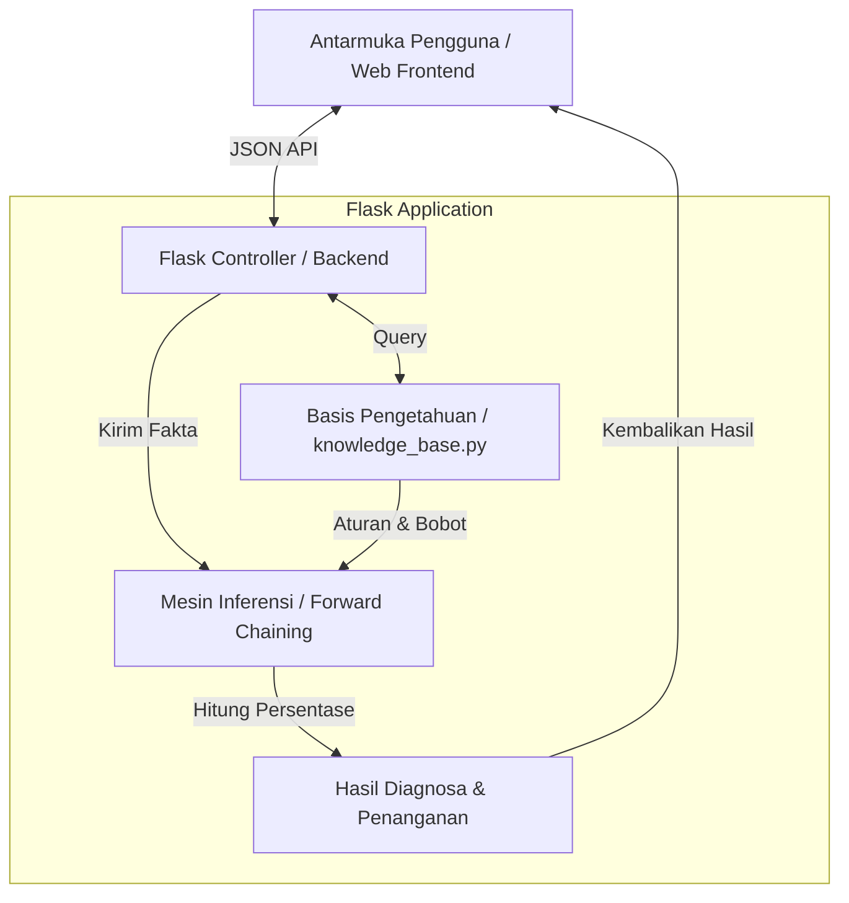
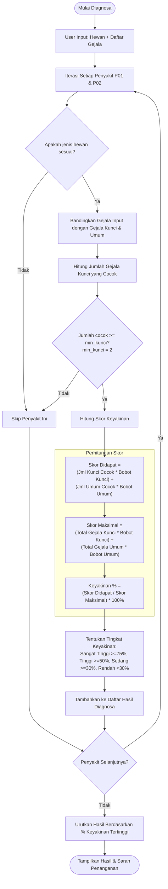

# Rencana Implementasi: Desain Sistematis & Estetika Premium VetExpert

Dokumen ini berisi analisis proyek Sistem Pakar VetExpert (Forward Chaining) saat ini, disertai dengan rencana peningkatan arsitektur kode dan desain antarmuka (UI/UX) agar menjadi lebih premium, dinamis, mudah dipahami, serta siap dipresentasikan secara akademis.

---

## 1. Analisis & Struktur Sistematis Proyek (Untuk Bahan Penjelasan)

Untuk memudahkan penjelasan kepada dosen atau pihak lain, sistem ini dapat dipecah menjadi **4 Komponen Utama Sistem Pakar**:
1. **Basis Pengetahuan (Knowledge Base)**: Daftar gejala (fakta dasar) dan aturan penyakit (Toxoplasmosis & Rabies) beserta bobot & ambang batas (threshold).
2. **Memori Kerja (Working Memory)**: Tempat penyimpanan sementara fakta-fakta gejala yang dialami oleh hewan peliharaan (input dari user).
3. **Mesin Inferensi (Inference Engine)**: Logika *Forward Chaining* yang mencocokkan fakta memori kerja dengan basis pengetahuan untuk menarik kesimpulan (persentase keyakinan).
4. **Antarmuka Pengguna (User Interface)**: Halaman web interaktif dengan dua mode input (Checklist & Tanya Jawab Dinamis) untuk berinteraksi dengan sistem.

### diagram Arsitektur Sistem

### Alur Penalaran Forward Chaining (Forward Chaining Inference Flow)
Sistem ini menggunakan metode **Forward Chaining** (penalaran maju) yang dimulai dari sekumpulan fakta gejala yang dipilih user, kemudian mencocokkan fakta tersebut dengan aturan penyakit.

---

## 2. Rencana Perubahan Kode (Proposed Changes)

Untuk membuat proyek ini terstruktur dan mudah dijelaskan, kita akan melakukan pemisahan kode (*separation of concerns*) dan menambahkan algoritma tanya jawab dinamis.

### [Component 1] Refactoring Backend Flask & Knowledge Base

#### [NEW] [knowledge_base.py](file:///d:/Kecerdasan%20Buatan/sistem_pakar/knowledge_base.py)
*   Memindahkan data `GEJALA` dan `PENYAKIT` dari `app.py` ke file ini agar backend bersih dan mudah menunjukkan "Di mana database pengetahuannya disimpan".

#### [MODIFY] [app.py](file:///d:/Kecerdasan%20Buatan/sistem_pakar/app.py)
*   Mengimpor `GEJALA` dan `PENYAKIT` dari `knowledge_base.py`.
*   Menghapus redundansi data basis pengetahuan dari file utama.

---

### [Component 2] Antarmuka Pengguna & Tanya Jawab Dinamis (UI/UX)

#### [MODIFY] [index.html](file:///d:/Kecerdasan%20Buatan/sistem_pakar/templates/index.html)
*   **Desain Estetika Premium**:
    *   Menggunakan font Google **Plus Jakarta Sans** atau **Inter** yang bersih dan modern.
    *   Warna-warna harmonis menggunakan variabel CSS HSL/Hex (Sleek Dark Slate, Royal Blue, Emerald Green, Amber, Rose Red).
    *   Tampilan Glassmorphic dengan blur latar belakang (`backdrop-filter`) dan bayangan lembut (`box-shadow`).
    *   Penggantian emoji dengan ikon SVG modern agar terlihat seperti aplikasi medis/hewan profesional kelas atas.
    *   Responsive Grid yang lebih rapi untuk checklist gejala.
*   **Algoritma Tanya Jawab Dinamis (Smart Pruning)**:
    *   Saat ini chatbot menanyakan seluruh 24 gejala secara berurutan. Ini sangat tidak efisien dan membosankan.
    *   Kita akan mengimplementasikan **Dynamic Questioning**:
        1. Pertama, pilih jenis hewan (Kucing/Anjing).
        2. Tanyakan 4 Gejala Umum (`G01` s.d `G04`).
        3. Berdasarkan jawaban gejala umum dan gejala yang sudah ditanyakan, sistem menghitung apakah penyakit (Toxoplasmosis atau Rabies) masih mungkin terjadi.
        4. Jika salah satu penyakit sudah tidak mungkin memenuhi syarat kelayakan (`min_kunci = 2`), sistem akan langsung memangkas (*pruning*) semua pertanyaan gejala kunci penyakit tersebut.
        5. Jika kedua penyakit sudah tidak mungkin dicapai (misal user menjawab "Tidak" pada semua gejala awal), chatbot akan langsung berhenti dan memberikan hasil diagnosa negatif tanpa menanyakan gejala tersisa.
        6. Hal ini memotong jumlah pertanyaan dari 24 pertanyaan menjadi hanya 4 - 10 pertanyaan saja tergantung kondisi hewan! Ini sangat bagus untuk bahan demonstrasi ilmiah.

---

## 3. Rencana Verifikasi (Verification Plan)

### Verifikasi Manual
1.  **Pengujian Checklist**:
    *   Pilih "Kucing" -> Centang gejala demam tinggi (G01), lemas (G03), mata merah (G05), gangguan saraf (G13).
    *   Klik diagnosa, pastikan hasil perhitungan persentase Toxoplasmosis keluar dengan benar sesuai bobot.
2.  **Pengujian Chatbot Dinamis**:
    *   Mulai chatbot -> Pilih Anjing.
    *   Jawab "Tidak" pada semua gejala umum.
    *   Jawab "Tidak" pada gejala-gejala kunci berikutnya.
    *   Perhatikan apakah chatbot berhenti lebih cepat (tidak sampai 24 pertanyaan) karena sistem menyimpulkan bahwa hewan tersebut sehat (Toxoplasmosis & Rabies tereliminasi).
3.  **Pengujian Responsif UI**:
    *   Cek tampilan di mode mobile (layar sempit) dan pastikan grid gejala dan jendela chatbot menyesuaikan dengan sempurna tanpa overflow.

---

> [!NOTE]
> Pemisahan file ini akan membuat kode lebih mudah diterangkan ke dosen, karena Anda bisa menunjukkan struktur modular: `app.py` sebagai pengontrol, `knowledge_base.py` sebagai database pengetahuan, dan `index.html` sebagai antarmuka user.

> [!IMPORTANT]
> Silakan tinjau rencana ini. Jika Anda menyetujuinya, saya akan mulai membuat file `knowledge_base.py`, merapikan `app.py`, dan membangun desain web yang memukau di `index.html`.
